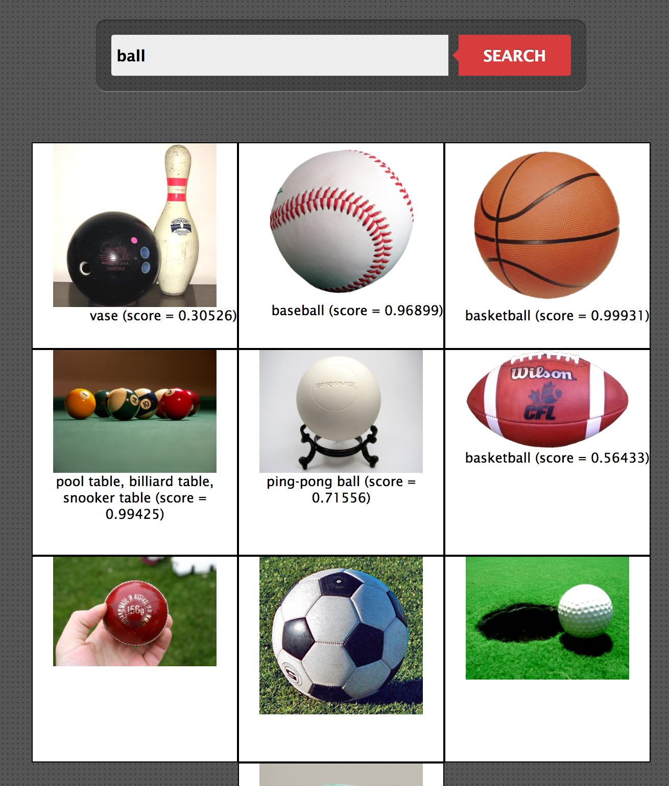

# Image Search and Tagging

The demo apps are HTTP servers designed specifically for exercising demo scenarios in Waiter.
This demo application performs image search and then tags the images using the [inception-v3 model built in tensorflow](https://www.tensorflow.org/tutorials/image_recognition).

The demo highlights the following features of Waiter:
1. Invoking different services from a client (i.e. the demo page)
1. Running different services (image search and image tagging) on Waiter
1. Services with different concurrency level support
1. [Scaling of services](../../waiter/docs/autoscaling.md) (image tagging)

Steps to demo:
1. Launch Waiter (e.g. on port 9091) `$ lein do clean, compile, run some-config.edn`
1. Build the demo app docker image: `$ bin/build-docker-image.sh`
1. Register the tokens for `image-search` and `image-tagging`: `$ bin/register-demo-tokens.sh`
1. Open the demo page, e.g., by directly opening [demo.html](resources/demo.html) on a browser.
1. Perform your image search and notice the images being tagged incrementally. 

# Build Uberjar

```bash
$ lein uberjar
...
Created /path-to-tensorflow-image-tagging/target/uberjar/tensorflow-image-tagging-0.1.0-SNAPSHOT.jar
Created /path-to-tensorflow-image-tagging/target/uberjar/tensorflow-image-tagging-0.1.0-SNAPSHOT-standalone.jar
```

# Test

```bash
$ lein run --port PORT

$ curl -XPOST $(hostname):PORT/status
OK
...
```

