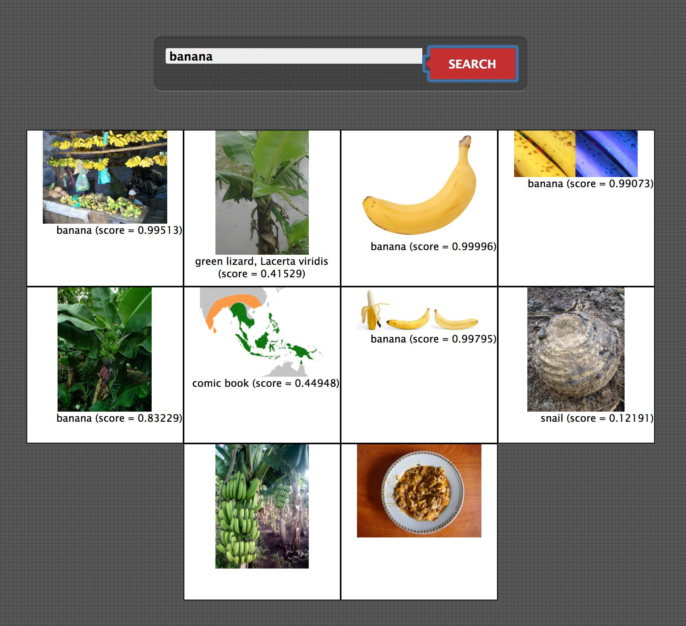

The kitchen app is an HTTP server designed specifically for exercising test scenarios in Waiter.
The [Waiter integration tests](../waiter/integration) rely heavily on kitchen for verifying that Waiter behaves as expected in various situations.

# Build Uberjar

```bash
$ lein uberjar
...
Created /path-to-waiter-kitchen/target/uberjar/kitchen-0.1.0-SNAPSHOT.jar
Created /path-to-waiter-kitchen/target/uberjar/kitchen-0.1.0-SNAPSHOT-standalone.jar
```

# Test

```bash
$ lein run --port PORT

$ curl -XPOST $(hostname):PORT
Hello World

$ curl -XPOST -H "x-kitchen-echo;" -d "some text I want back" $(hostname):PORT
some text I want back

$ curl -v -XPOST -H "x-kitchen-cookies: a=b,c=d" $(hostname):PORT
...
< HTTP/1.1 200 OK
< Set-Cookie: a=b
< Set-Cookie: c=d
...
```

# Demos

## Image Search and Tagging

The demo application performs image search and then tags the images using the inception-v3 model built in tensorflow.
The demo highlights the following features of waiter:
1. Invoking different services from a client (i.e. the demo page)
1. Running different services (image search and image tagging) on waiter
1. Services with different concurrency level support
1. Scaling of services (image tagging)

Since the demo uses tensorflow, it will need to be installed:
```bash
$ pip3 install --upgrade https://storage.googleapis.com/tensorflow/linux/cpu/tensorflow-1.3.0-cp34-cp34m-linux_x86_64.whl
```

Steps to demo:
1. Launch waiter (e.g. on port 9091) `$ lein do clean, compile, run some-config.edn`
1. Build kitchen  `$ bin/build-uberjar.sh`
1. Register the tokens for `image-search` and `image-tagging`: `$ bin/register-demo-tokens.sh`
1. Open the demo page, e.g., by directly opening [demo.html](resources/demo.html) on a browser.
1. Perform your image search and notice the images being tagged incrementally. 
