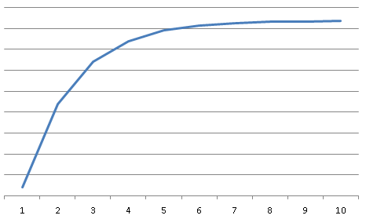
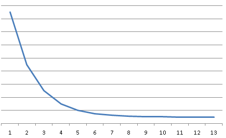
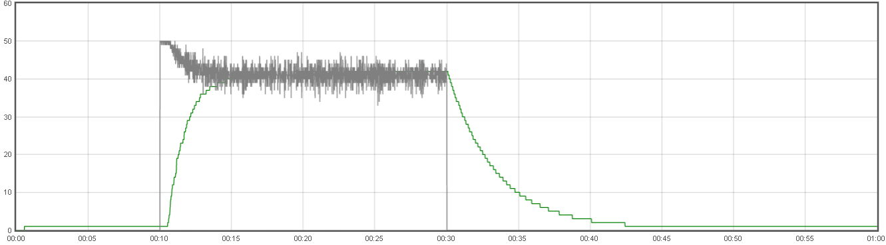
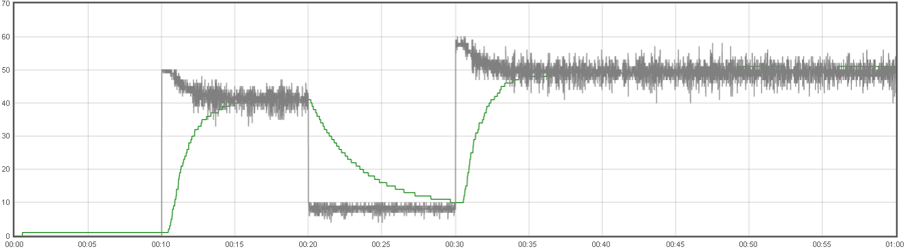
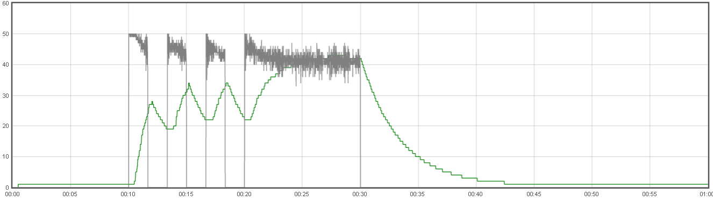

# Waiter's Autoscaling Algorithm

Waiter’s primary design goal is to scale services with unpredictable traffic loads. Our autoscaling algorithm reacts to each individual service’s traffic and scales each service on demand. Most other existing autoscaling platforms focus on host-level scaling. For example, Netflix's autoscaling engine, Scryer[2](#scryer), predicts demand based on predictable traffic patterns and provisions instances based on the prediction. The AWS Auto Scaling feature[1](#aws-auto-scaling) scales Amazon EC2 instances based on user-defined policies. Apache Stratos[3](#stratos) calculates the first derivative and second derivative of a stream of events within a time frame to predict future load.

Waiter handles unpredictable loads, maximizes service throughput instead of cluster total capacity, and achieves autoscaling without requiring user-defined rules. The design principals we applied in our autoscaling algorithm are simplicity and wide applicability. The Waiter platform has to serve business critical applications developed by all of our internal teams with various requirements. When it comes to autoscaling, we need to be able to easily explain the behavior to allow for easy troubleshooting and monitoring. The simplicity of the algorithm facilitates our communication and builds confidence in our users. On the other hand, we have to accommodate diverse applications with different needs. Applications running on Waiter can be services that preload massive amounts of data into memory, thus taking a long time to start up, services that conduct complex machine learning computations with long response latency, or services that serve interactive web interfaces. The autoscaling algorithm must be applicable and tunable to these different scenarios.

We have two goals to optimize: service throughput, and resource utilization, which naturally conflict with each other. The autoscaling algorithm tries to optimize these two competing goals with the best balance. The algorithm runs periodically. At each cycle, it answers two questions:

1. How many ideal service instances do we need?
1. How fast should we scale up / down to the targeted number of instances?

To achieve maximum parallelism, the number of service instances ideally should be equal to the number of outstanding requests in the queue. Waiter simply uses this number as the target.

The second question is a little tricky to answer since our goal is to optimize both throughput and resource utilization. The naive way to scale is to sharply jump to the target by launching all of the required instances at the same time. This solution appears to achieve the "ideal" very fast but in reality it usually ends up wasting a lot of resources. We want to react to spikes in traffic quickly, but don't want to overshoot the target since scaling-up is expensive, especially if the service instance takes a large amount of resources or a long time to start up. The real optimal number of instances can be impacted by many factors in different scenarios, like service start-up time, request-response time, frequency of incoming requests, etc.  As an example for explanation, if there are two clients sending requests to Waiter, each request takes 1 second to process, and each client waits for 1 second to send the next request upon receiving a response. One single service instance can achieve optimal throughput and resource utilization to serve both clients once they achieve a balanced state in which each of them sends requests in an alternating fashion.

The philosophy we use in the autoscaling algorithm is to maximize Impact-on-Investment (IOI). Impact here is the percentage of increased/decreased throughput, and investment is the resources each instance will take. When we scale up, the impact on throughput is higher when we are further away from the target. When we scale down, the impact on throughput will be more significant by tearing down one instance since there are fewer instances. Therefore, we chose an Exponential Smoothing[4](#smoothing) algorithm tunable with a scale-up factor and a scale-down factor to scale up / down faster initially and slower when we get closer to the target (see Figure 1). Waiter also periodically checks the health of instances, and tears down the unhealthy instances first. If all instances are healthy, we choose to kill the youngest instances to minimize potential negative performance impact on the applications.

 

Figure 1: Exponential Smoothing based Scale Up and Down

# Simulations

We use a [simulator](../src/waiter/simulator.clj) to experiment with different traffic patterns and tune Waiter's autoscaling algorithm. To model different scenarios, we can define traffic pattern parameters like the number of clients at different points in time, the request/response time, the time between requests, service startup time, scale up factor, scale down factor, etc.

The simulation results below show that Waiter is able to respond to different traffic patterns -- stable (Figure 2), step (Figure 3), and spiky (Figure 4) -- effectively with the same scale-factor settings.

Figure 2: Waiter Reacts to Stable Traffic

Figure 3: Waiter Reacts to Step Traffic

Figure 4: Waiter Reacts to Spiky Traffic

# References

- <a name="aws-auto-scaling">1</a>: [AWS Auto Scaling](https://aws.amazon.com/autoscaling/)
- <a name="scryer">2</a>: [Scryer: Netflix's Predictive Auto Scaling Engine](http://techblog.netflix.com/2013/11/scryer-netflixs-predictive-auto-scaling.html)
- <a name="stratos">3</a>: [Apache Stratos](http://stratos.apache.org/)
- <a name="smoothing">4</a>: [Exponential Smoothing](https://en.wikipedia.org/wiki/Exponential_smoothing)